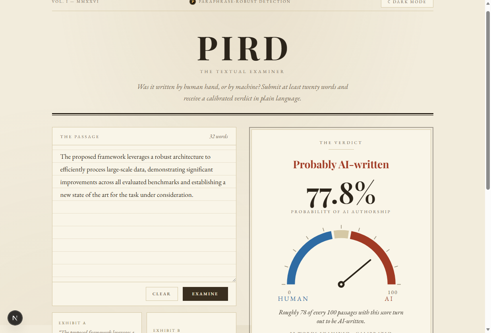
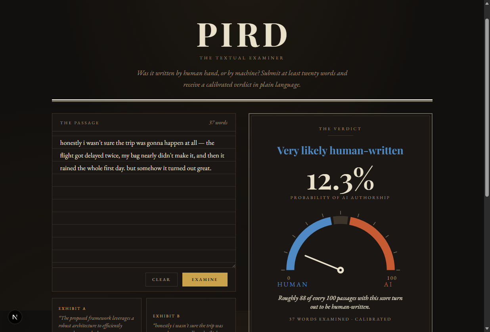
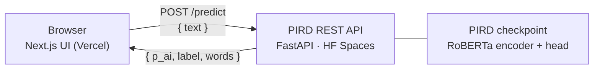

<div align="center">


# AI-TextVerify

**PIRD — The Textual Examiner.** A web client for paraphrase-robust,
calibrated detection of AI-generated text.

[](https://nextjs.org)
[](https://react.dev)
[](https://tailwindcss.com)
[](https://www.typescriptlang.org)
[](LICENSE)

*Was it written by human hand, or by machine?*

| Vintage classic light | Vintage classic dark |
| :---: | :---: |
|  |  |

</div>

---

## Overview

AI-TextVerify is the front-end for **PIRD** (Paraphrase-Invariant Robust
Detection), a research detector of AI-generated text. Paste a passage of at
least twenty words and receive a **calibrated verdict**:

- a plain-language headline — *Almost certainly / Very likely / Probably
  AI-written*, *Too close to call*, or the human-side equivalents;
- the calibrated probability of AI authorship as a headline number;
- a HUMAN ↔ AI needle dial;
- a one-sentence interpretation — *"Roughly 88 of every 100 passages with
  this score turn out to be human-written."*

The design is a vintage-newspaper aesthetic ("The Textual Examiner") with two
hand-tuned themes — aged-ivory **classic white** and charcoal-and-gold
**classic black** — that follow the system preference and persist the
visitor's choice. The human/AI polarity colors (Prussian blue / oxblood) are
validated colorblind-safe on both surfaces.

## Architecture



The UI is a fully static Next.js app — no server-side secrets, no database.
Inference runs on a [Hugging Face Space](https://huggingface.co/spaces/MohsinEli/pird-api)
(FastAPI, CPU) that the browser calls directly over CORS.

## Getting started

**Prerequisites:** Node.js ≥ 20.

```bash
git clone https://github.com/MIHMahmudEli/AI-TextVerify.git
cd AI-TextVerify
npm install
npm run dev        # http://localhost:3000
```

Production build:

```bash
npm run build
npm start
```

## Configuration

All configuration is optional — the app works out of the box against the
public PIRD API.

| Variable | Default | Description |
| --- | --- | --- |
| `NEXT_PUBLIC_PIRD_API_URL` | `https://mohsineli-pird-api.hf.space` | Base URL of the PIRD REST API |

Copy `.env.example` to `.env.local` to override locally.

## API reference

The UI consumes a single endpoint:

```http
POST /predict
Content-Type: application/json

{ "text": "A passage of at least twenty words…" }
```

```json
{ "p_ai": 0.7782, "label": "ai", "words": 32, "calibrated": true }
```

Passages under 20 words return `422` with a human-readable `detail` message.
The first request after the Space has been idle may take ~30 s to wake; after
that, inference is ~1–2 s.

## Project structure

```
src/
├── app/
│   ├── layout.tsx        # fonts, metadata, pre-hydration theme script
│   ├── page.tsx          # masthead, examiner, method, colophon
│   ├── globals.css       # Tailwind v4 theme: both vintage palettes
│   ├── icon.svg          # favicon (vintage seal)
│   └── favicon.ico
└── components/
    ├── Analyzer.tsx      # passage input, exhibits, verdict panel
    ├── Gauge.tsx         # HUMAN ↔ AI needle dial (SVG)
    └── ThemeToggle.tsx   # light/dark toggle, persisted
```

## Deployment

Deploys to [Vercel](https://vercel.com/new) with zero configuration: import
the repository and accept the defaults. To point at a different API
deployment, set `NEXT_PUBLIC_PIRD_API_URL` under *Project → Settings →
Environment Variables*.

## Related

- **Research repository** — training, experiments, and evaluation:
  [MIHMahmudEli/Pird-ai-text-detector](https://github.com/MIHMahmudEli/Pird-ai-text-detector)
- **REST API Space** — [MohsinEli/pird-api](https://huggingface.co/spaces/MohsinEli/pird-api)
- **Gradio demo Space** — [MohsinEli/paraphrase-robust-ai-detector](https://huggingface.co/spaces/MohsinEli/paraphrase-robust-ai-detector)

## Disclaimer

This is a research demonstration. Predictions are probabilistic and **not
infallible** — do not use them as sole evidence of misconduct.

## License

Released under the [MIT License](LICENSE).
